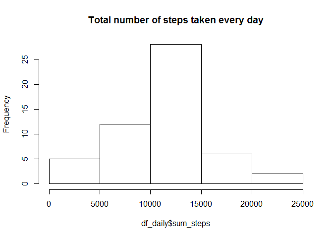
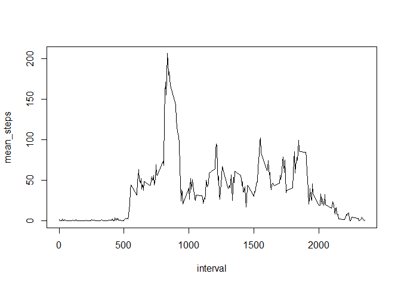
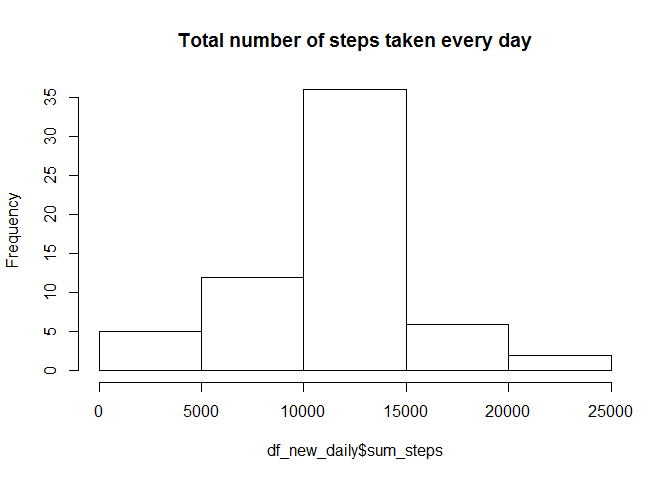
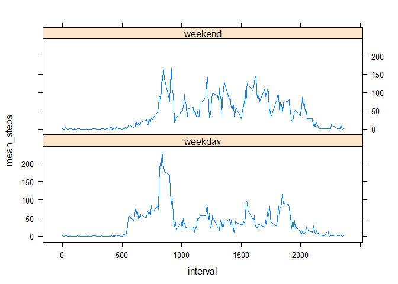

# Reproducible Research: Peer Assessment 1


## Loading and preprocessing the data


```r
# Load the data (i.e. read.csv())
con <- file("C:/Users/user/Documents/datasciencecouresa/activity.csv","r")
df <- read.csv(con, header = TRUE)
close(con)
# Process/transform the data (if necessary) into a format suitable for your analysis
df$date <- as.Date(as.character(df$date),"%Y-%m-%d")
head(df,10)
```

```
##    steps       date interval
## 1     NA 2012-10-01        0
## 2     NA 2012-10-01        5
## 3     NA 2012-10-01       10
## 4     NA 2012-10-01       15
## 5     NA 2012-10-01       20
## 6     NA 2012-10-01       25
## 7     NA 2012-10-01       30
## 8     NA 2012-10-01       35
## 9     NA 2012-10-01       40
## 10    NA 2012-10-01       45
```

## What is mean total number of steps taken per day?


```r
library(dplyr)
```

```
## 
## Attaching package: 'dplyr'
```

```
## The following objects are masked from 'package:stats':
## 
##     filter, lag
```

```
## The following objects are masked from 'package:base':
## 
##     intersect, setdiff, setequal, union
```

```r
# Calculate the total number of steps taken per day
df_daily <- df %>% filter(!is.na(steps)) %>% select(steps,date) %>% group_by(date) %>% summarise(sum_steps = sum(steps))
df_daily
```

```
## Source: local data frame [53 x 2]
## 
##          date sum_steps
##        (date)     (int)
## 1  2012-10-02       126
## 2  2012-10-03     11352
## 3  2012-10-04     12116
## 4  2012-10-05     13294
## 5  2012-10-06     15420
## 6  2012-10-07     11015
## 7  2012-10-09     12811
## 8  2012-10-10      9900
## 9  2012-10-11     10304
## 10 2012-10-12     17382
## ..        ...       ...
```

```r
# Make a histogram of the total number of steps taken each day
hist(df_daily$sum_steps, main = "Total number of steps taken every day")
```



```r
# Calculate and report the mean and median of the total number of steps taken per day
mean(df_daily$sum_steps)
```

```
## [1] 10766.19
```

```r
median(df_daily$sum_steps)
```

```
## [1] 10765
```


## What is the average daily activity pattern?


```r
# Make a time series plot (i.e. type = "l") of the 5-minute interval (x-axis) and the average number of steps taken, averaged across all days (y-axis)
df_interval <- df %>% filter(!is.na(steps)) %>% select(steps,interval) %>% group_by(interval) %>% summarise(mean_steps = mean(steps))
with(df_interval, plot(interval, mean_steps,type = "l"))
```



```r
# Which 5-minute interval, on average across all the days in the dataset, contains the maximum number of steps?
interval_w_max_steps <- df_interval %>% filter(mean_steps == max(df_interval$mean_steps))
interval_w_max_steps
```

```
## Source: local data frame [1 x 2]
## 
##   interval mean_steps
##      (int)      (dbl)
## 1      835   206.1698
```


## Imputing missing values

```r
# Calculate and report the total number of missing values in the dataset (i.e. the total number of rows with NAs)
df_missing <- df %>% filter(is.na(steps))
head(df_missing,10)
```

```
##    steps       date interval
## 1     NA 2012-10-01        0
## 2     NA 2012-10-01        5
## 3     NA 2012-10-01       10
## 4     NA 2012-10-01       15
## 5     NA 2012-10-01       20
## 6     NA 2012-10-01       25
## 7     NA 2012-10-01       30
## 8     NA 2012-10-01       35
## 9     NA 2012-10-01       40
## 10    NA 2012-10-01       45
```

```r
# Devise a strategy for filling in all of the missing values in the dataset. The strategy does not need to be sophisticated. For example, you could use the mean/median for that day, or the mean for that 5-minute interval, etc.
df_missing <- merge(df_missing, df_interval, by.x = "interval", by.y = "interval") ## mean for that 5-min interval

df_missing$steps <- df_missing$mean_steps
head(df_missing,10)
```

```
##    interval     steps       date mean_steps
## 1         0 1.7169811 2012-10-01  1.7169811
## 2         0 1.7169811 2012-11-30  1.7169811
## 3         0 1.7169811 2012-11-04  1.7169811
## 4         0 1.7169811 2012-11-09  1.7169811
## 5         0 1.7169811 2012-11-14  1.7169811
## 6         0 1.7169811 2012-11-10  1.7169811
## 7         0 1.7169811 2012-10-08  1.7169811
## 8         0 1.7169811 2012-11-01  1.7169811
## 9         5 0.3396226 2012-11-09  0.3396226
## 10        5 0.3396226 2012-10-01  0.3396226
```

```r
# Create a new dataset that is equal to the original dataset but with the missing data filled in.
df_non_missing <- df %>% filter(!is.na(steps)) 
df_new <- rbind(df_non_missing, df_missing[,c(2:3,1)])

df_new_daily <- df_new %>% select(steps,date) %>% group_by(date) %>% summarise(sum_steps = sum(steps))
head(df_new_daily,10)
```

```
## Source: local data frame [10 x 2]
## 
##          date sum_steps
##        (date)     (dbl)
## 1  2012-10-01  10766.19
## 2  2012-10-02    126.00
## 3  2012-10-03  11352.00
## 4  2012-10-04  12116.00
## 5  2012-10-05  13294.00
## 6  2012-10-06  15420.00
## 7  2012-10-07  11015.00
## 8  2012-10-08  10766.19
## 9  2012-10-09  12811.00
## 10 2012-10-10   9900.00
```

```r
hist(df_new_daily$sum_steps, main = "Total number of steps taken every day")
```



```r
# Make a histogram of the total number of steps taken each day and Calculate and report the mean and median total number of steps taken per day.
mean(df_new_daily$sum_steps)
```

```
## [1] 10766.19
```

```r
median(df_new_daily$sum_steps)
```

```
## [1] 10766.19
```

```r
# Do these values differ from the estimates from the first part of the assignment? 
print(mean(df_new_daily$sum_steps) - mean(df_daily$sum_steps))
```

```
## [1] 0
```

```r
# What is the impact of imputing missing data on the estimates of the total daily number of steps?
print(median(df_new_daily$sum_steps) - median(df_daily$sum_steps) )
```

```
## [1] 1.188679
```
After the new dataset creation, there is no difference in the mean value of total Steps. But the median value of total number of steps per day has slighlty increased.


## Are there differences in activity patterns between weekdays and weekends?

```r
# Create a new factor variable in the dataset with two levels – “weekday” and “weekend” indicating whether a given date is a weekday or weekend day
Sys.setlocale("LC_TIME", "English")
```

```
## [1] "English_United States.1252"
```

```r
weekend <- c("Saturday", "Sunday")
df_new_1 <- df_new %>% filter(weekdays(df_new$date) %in% weekend) %>% mutate(weekend_flag = "weekend")
df_new_2 <- df_new %>% filter(!(weekdays(df_new$date) %in% weekend)) %>% mutate(weekend_flag = "weekday")
df_new_weekend <- rbind(df_new_1, df_new_2)
head(df_new_weekend,10)
```

```
##    steps       date interval weekend_flag
## 1      0 2012-10-06        0      weekend
## 2      0 2012-10-06        5      weekend
## 3      0 2012-10-06       10      weekend
## 4      0 2012-10-06       15      weekend
## 5      0 2012-10-06       20      weekend
## 6      0 2012-10-06       25      weekend
## 7      0 2012-10-06       30      weekend
## 8      0 2012-10-06       35      weekend
## 9      0 2012-10-06       40      weekend
## 10     0 2012-10-06       45      weekend
```

```r
table(df_new_weekend$weekend_flag)
```

```
## 
## weekday weekend 
##   12960    4608
```

```r
# Make a panel plot containing a time series plot (i.e. type = "l") of the 5-minute interval (x-axis) and the average number of steps taken, averaged across all weekday days or weekend days (y-axis).
df_new_weekend_plot <- df_new_weekend %>% select(steps,interval, weekend_flag) %>% group_by(interval, weekend_flag) %>% summarise(mean_steps = mean(steps))
library(lattice)
par(mfrow=c(2,1))
xyplot(mean_steps~ interval| as.factor(weekend_flag), data = df_new_weekend_plot, layout = c(1,2), type = "l")
```



